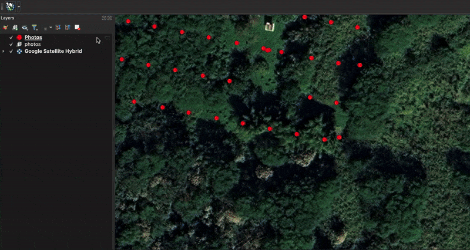

# Camera2Geo: camera to geographic space image convertion

> This plugin is under active development therefor not all features outlined in this readme are complete and the library is subject to major changes.

Camera2Geo converts raw drone or camera images into georeferenced GeoTIFFs via image metadata and a camera model. This can be helpful to quickly view individual aerial images in GIS software, label image features in geographic space, and view images in full resolution rather than in orthomosaic resolution. The core functionality is built from [Drone-Footprints](https://github.com/spifftek70/Drone-Footprints) but extended with additional features and an improved interface via a Python library, QGIS plugin, and CLI.

## Functionality

### camera2geo()
1. **Resolve Input Paths:** Uses a glob pattern to search for one or many images.

2. **Read EXIF Metadata:** Uses exiftool to extract GPS location, orientation, camera intrinsics, timestamp, and flight parameters.

3. **Determine Sensor Geometry:** Includes camera presets for many popular drones that are automatically applied but the user can provide custom values.

4. **Elevation & Camera Pose Refinement (optional):**
   - Use provided elevation raster or query for an online elevation API raster to sample ground position.
   - If RTK sidecar files are detected, refine camera altitude/orientation.
5. **Image Correction & Enhancement (optional)**
   - Lens distortion correction
   - Radiometric equalization
6. **Geographic Coordinate Convertion:** Computes ground footprint and projection based on camera model, orientation, and elevation, then reprojects into the target EPSG.
7. **Output GeoTIFF Creation:** Writes georeferenced TIFFs to the output directory; optionally writes as COG.

### read_metadata()
 Read metadata from one or more images and print the results as YAML and return values. Each parameter includes all metadata source fields that contribute to its value (primary + fallback).

### apply_metadata()
Apply or remove metadata on one or more images. If `output_images` is not provided, edits are applied in-place; otherwise, input files are copied first.

### search_cameras()
Look up cameras by maker and model.

### search_lenses()
Look up lenses compatible with the given camera.

## Usage
### QGIS
In QGIS, images can be converted from geotagged photo points and automatically added as a temporary layer. In addition, there is a processing tool that can handle bulk processing.


### Python 
In python, there is a simple function to process many images at once using glob input/output. An example is available in [example_python.py](docs/examples/example_python.py)
```python
camera2geo(
    input_images="/input/folder/*.JPG",
    output_images= "/output/folder/$.TIF",
    epsg = 4326,
    correct_magnetic_declination = True,
    cog = True,
    image_equalize = False,
    lens_correction = True,
    elevation_data = True,
)
```

### CLI
In terminal, there is a simple [fire](https://github.com/google/python-fire) based command line interface.

```bash
camera2geo \
  "/input/folder/*.JPG" \
  "/output/folder/$.TIF" \
  --epsg 4326 \
  --correct_magnetic_declination \
  --cog \
  --image_equalize \
  --lens_correction \
  --elevation_data
  ```

## Installation

### QGIS Plugin Installation
1. **Install QGIS**

2. **Install camera2geo QGIS plugin:**
- Go to Plugins → Manage and Install Plugins…
- Find camera2geo in the list, install, and enable it
- Find the plugin in the toolbar to convert individual geophoto points temporarily or in the Processing Toolbox for bulk processing

> **Python dependencies:** The plugin will attempt to automatically install all Python dependencies that it requires in the QGIS Python interpreter using [QPIP](https://github.com/opengisch/qpip). If it is unable to, the user must manually locate the QGIS python interpreter and install the libraries dependencies.

### Python Library and CLI Installation

1. **System requirements:** Before installing, ensure you have the following system-level prerequisites:

- exiftool
- Python ≥ 3.10 and ≤ 3.12
- PROJ ≥ 9.3
- GDAL ≥ 3.10.2
- pip

An easy way to install these dependancies is to use [Miniconda](https://www.anaconda.com/docs/getting-started/miniconda/install#quickstart-install-instructions):
```bash
conda create -n camera2geo python=3.12 "gdal>=3.10.2" "proj>=9.3" exiftool -c conda-forge
conda activate camera2geo
```

2. **Install camera2geo:** You can automatically install the library via [PyPI](https://pypi.org/). (this method installs only the core code as a library):

```bash
pip install camera2geo
```

---

### Source Installation

1. **Clone the Repository**
```bash
git clone https://github.com/cankanoa/camera2geo.git
cd camera2geo
```

2. **System requirements:** Before installing, ensure you have the following system-level prerequisites:

- exiftool
- Python ≥ 3.10 and ≤ 3.12
- PROJ ≥ 9.3
- GDAL = 3.10.2

An easy way to install these dependancies is to use [Miniconda](https://www.anaconda.com/docs/getting-started/miniconda/install#quickstart-install-instructions):
```bash
conda create -n camera2geo python=3.12 "gdal>=3.10.2" "proj>=9.3" exiftool ````-c conda-forge
conda activate camera2geo
```

3. **Install Dependancies:** The `pyproject.toml` defines core dependancies to run the library.

```bash
pip install . # Normal dependencies
pip install -e ".[dev]"   # Developer dependencies
```

#  Python Tests
All public functions in the Python library have tests. They are automatically run when commiting to main and can be run locally with following command:
```bash
pytest
```


